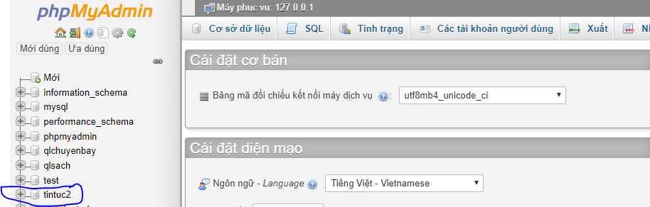

## Tool hỗ trợ

## Giới Thiệu về website tin tức

- Website không còn là công cụ xa lạ của các doanh nghiệp, các tổ chức hay thậm chí là các cá nhân bởi hầu hết với sự phát triển của internet mỗi đối tượng đều sở hữu cho mình một website.
Website sẽ là nơi cung cấp nguồn thông tin hữu ích. Tất tần tật mọi thông tin mà bạn mong muốn truyền tải đến khách hàng đều có thể thông qua website. Bởi theo định nghĩa website là gì, website đã được giải mã là một trang thông tin đặc biệt dành cho khách hàng. Tất cả mọi thông tin về doanh nghiệp, dịch vụ, sản phẩm đến chương trình khuyến mãi, hướng dẫn sử dụng, chia sẻ bí quyết bạn đều có thể cập nhật trên trang web của mình. Tuy nhiên, mọi thông tin cần được thể hiện một cách rõ ràng, mạch lạc để tạo nên sự thu hút đối tượng mục tiêu mà bạn nhắm đến. 

## Công dụng và ứng dụng  
### Công dụng

- Tìm kiếm bài viết theo tiêu đề.
- Tìm kiếm bài viết theo các danh mục.
- Đọc bài viết trực tuyến.

### Ứng dụng
- Ứng dụng cho đọc giả tiềm kiếm thông tin và cập nhật thông tin mới.
- Ứng dụng cho những đọc giả muốn biết về thông tin mới trong xã hội.

## Mục đích  
### Đầu vào
- Tiêu đề bài viết.
- Tên danh mục.
- Email, tài khoản và mật khẩu người dùng.

### Đầu ra
 - Danh mục bài viết.
 - Danh sách các bài viết.
 - Nội dung của bài viết.

## Các bước cài đặt

- Bước 1 :  Clone Responsity này về (chú ý: đổi tên folder vender1 thành tên vender).
- Bước 2 : Nếu cài đặt xampp, thì copy folder vừa clone về vô thư mục htdocs của xampp.
- Bước 3 : Mở xampp và run Apache và Mysql như hình dưới đây.

   

- Bước 4 : Mở phpmyadmin. Tạo mới một database mới với tên tintuc2 tiếp đó import
 file tintuc2.sql vô database mới tạo.

	 
- Bước 5 : Vào trình duyệt mở localhost/ [tên thư mục folder trong htdost]/public/[phần bạn muốn vào(trangchu hoặc admin/tintuc/danhsach)].
- Bước 6 : Enter
 
## Nội dung bài toán
### Chức Năng Làm được:
- Thiết kế giao diện người dùng
	 
- Giao diện đọc nội dung bài viết.
	 
- Thiết kế giao diện admin
	 

## Hướng phát triển
-  Hiển thị video và xem trực tuyến.
- Tìm kiếm bài viết với các từ khóa gần giống.
- Phát triển thành một website với thông tin cập nhật nhanh chóng nhất.

## Tác Giả
**Phùng thế vinh**:
- Module :resoures -> View -> Admin 
- Module :http -> Controller (loaitincontroller.php , theloaicontroller.php, tintuccontroller.php, usercontroller.php)

**Y Huy Bol**   
- Module : resoures ->layout + pages
- Module : http -> Controller (pagecontroller.php)

## Tham khảo
 - Tham khảo tại :http://khoapham.com

 
